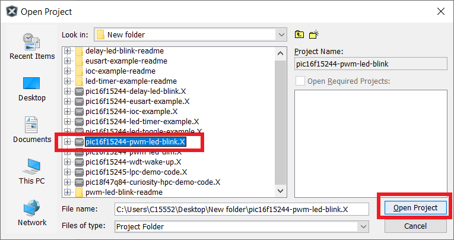
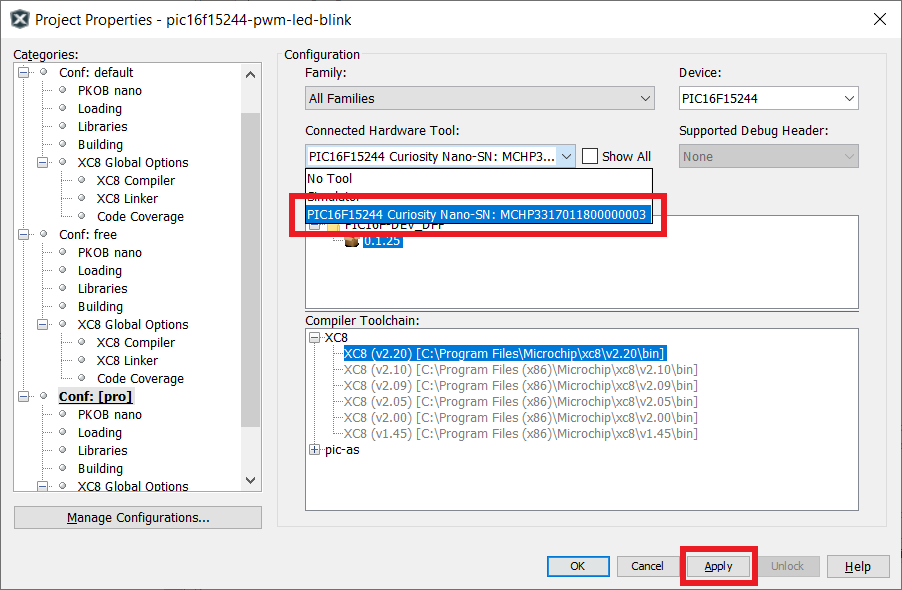
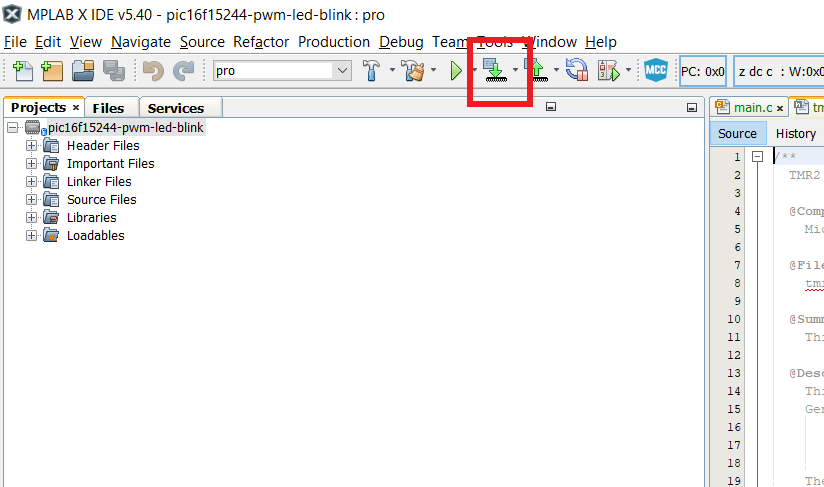
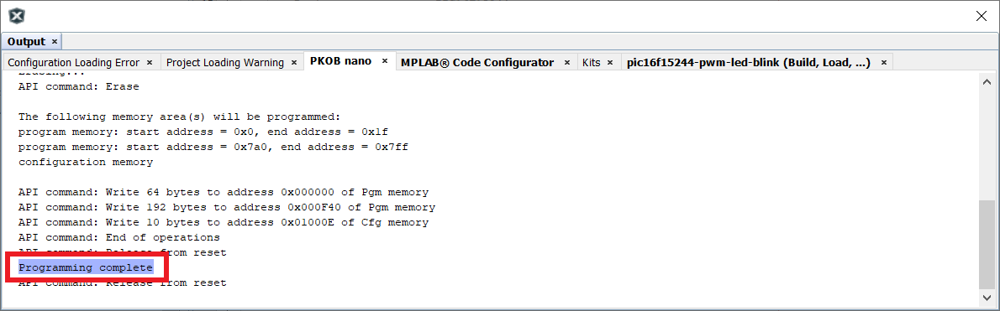
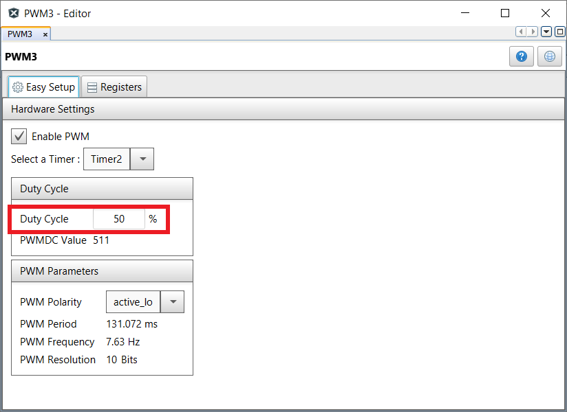
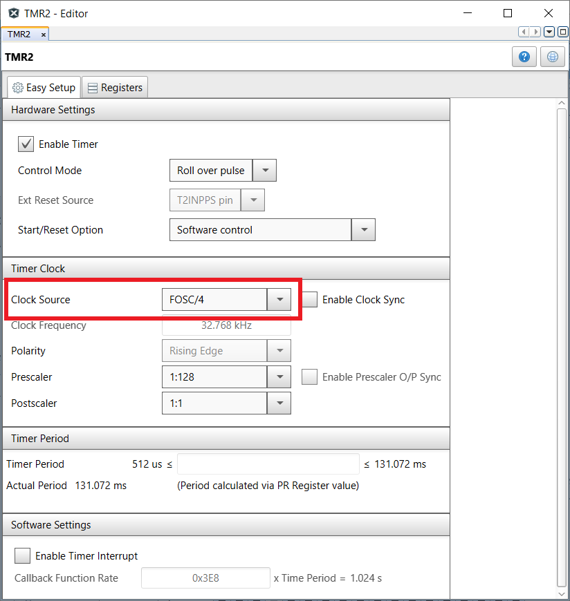

<!-- Please do not change this html logo with link -->

# Blink an LED using PWM with PIC16F15244

The 'pic16f15244-pwm-led-blink' code example uses the PIC16F15244 Curiosity Nano Development board to demonstrate how to toggle LED0 using the PWM module.

##### PIC16F15244 Curiosity Nano Development Board:

## Related Documentation
- [PIC16F15244 Product Page](https://www.microchip.com/wwwproducts/en/PIC16F15244)

## Software Used
- MPLAB® X IDE 5.40 or newer [(microchip.com/mplab/mplab-x-ide)](http://www.microchip.com/mplab/mplab-x-ide)
- MPLAB® XC8 2.20 or a newer compiler [(microchip.com/mplab/compilers)](http://www.microchip.com/mplab/compilers)
- MPLAB® Code Configurator (MCC) 3.95.0 or newer [(microchip.com/mplab/mplab-code-configurator)](https://www.microchip.com/mplab/mplab-code-configurator)
- MPLAB® Code Configurator (MCC) Device Libraries PIC10 / PIC12 / PIC16 / PIC18 MCUs [(microchip.com/mplab/mplab-code-configurator)](https://www.microchip.com/mplab/mplab-code-configurator)
- Microchip PIC16F1xxxx Series Device Support (1.4.119) or newer [(packs.download.microchip.com/)](https://packs.download.microchip.com/)

## Hardware Used
- PIC16F15244 Curiosity Nano [(EV09Z19A)](https://www.microchip.com/Developmenttools/ProductDetails/EV09Z19A)
- Micro-USB to USB 2.0 cable

## Setup
1. Connect the PIC16f15244 Curiosity Nano board to a PC using the Micro-USB to USB 2.0 cable.
2. If not already on your system, download and install MPLABX IDE version 5.40 (or newer).
3. If not already on your system, download and install the XC8 C-Compiler version 2.20 (or newer).
4. Open the 'pic16f15244-pwm-led-blink.X' project as shown in Figure 1.

  ###### Figure 1: Open Project Window
  

5. Press the 'Project Properites' button to open the Project Properties window. Select the Curiosity tool from the Tools drop-down menu as shown in Figure 2.

  ###### Figure 2: Select the Nano in Project Properties Window
  

6. Press the 'Make and Program Device' button to program the PIC (see Figure 3). Verify that the device was successfully programmed (see Figure 4).

  ###### Figure 3: 'Make and Program Device' Button
  

  ###### Figure 4: Program Complete
  

## Operation
After the Nano board is programmed, LED0 will toggle between its 'ON' and 'OFF' approximately seven times per second. PWM3 is configured such that the PWM frequency is 7.63 Hz, which translates into a PWM period of 131 ms. During each PWM period, the PWM output toggles between logic 'HIGH' and logic 'LOW' states. The duration of the PWM's active state is referred to as the Duty Cycle, and may be an active-high output or active-low output, which is determined by the PWMxPOL bit. In this example, the duty cycle is configured to be 50% (see Figure 5), which means both the active and inactive states are of equal time value. In other words, the PWM output will be 'ON' for 50% of the period, and 'OFF' for the other 50%.

Timer2 is is used as the PWM module timebase. When using Timer2 as the PWM timebase, it is important to use the 'FOSC/4' clock source for Timer2 (see Figure 6). This allows the timer to be used in conjunction with the PWM module, and since it is an internal oscillator source, it is already syncronized to the system clock.

  ###### Figure 5: PWM3 Configuration in MCC
  

  ###### Figure 6: TMR2 Configuration in MCCC
  

## Summary
The 'pic16f15244-pwm-led-blink' code example uses the PIC16F15244 Curiosity Nano Development board to demonstrate how to toggle LED0 using the PWM module. LED0 will toggle between 'ON' and 'OFF' states approximately 7 times per second. The PWM output is configured to toggle at a 50% duty cycle, which means that during each PWM period, the output toggles equally between its active and inactive states.
